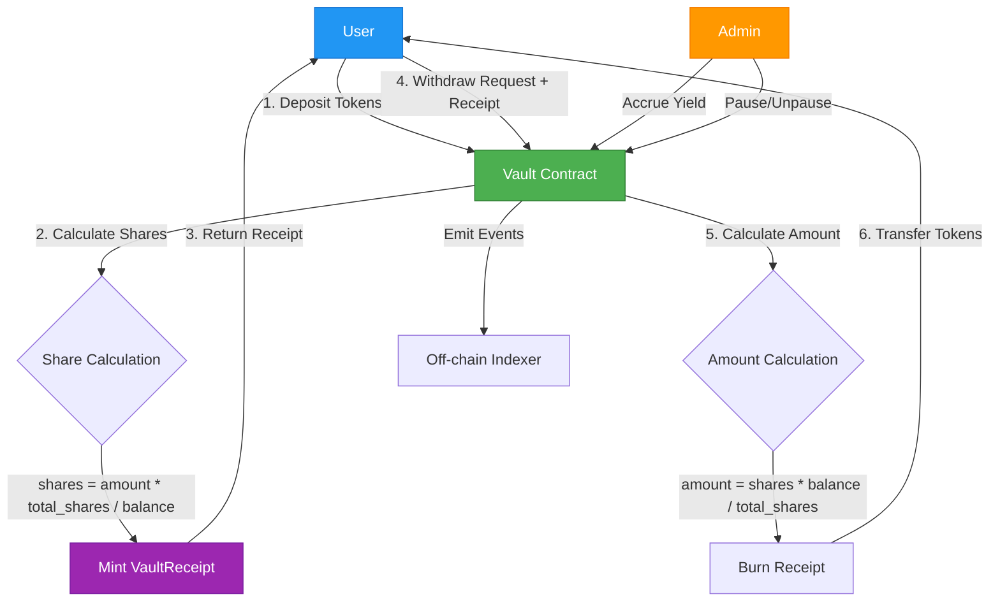
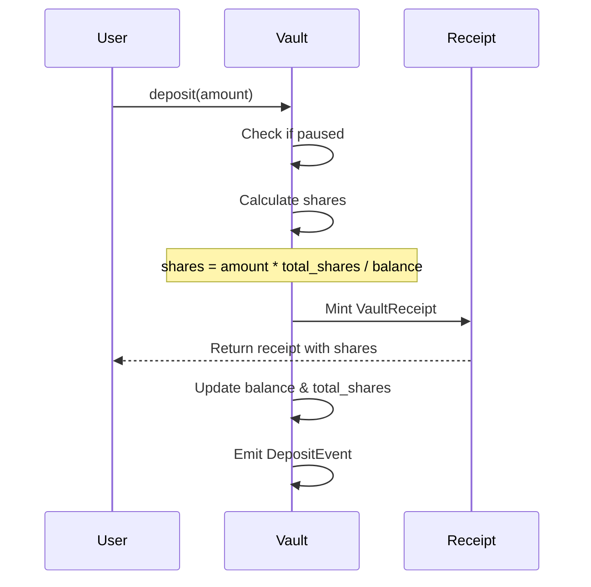
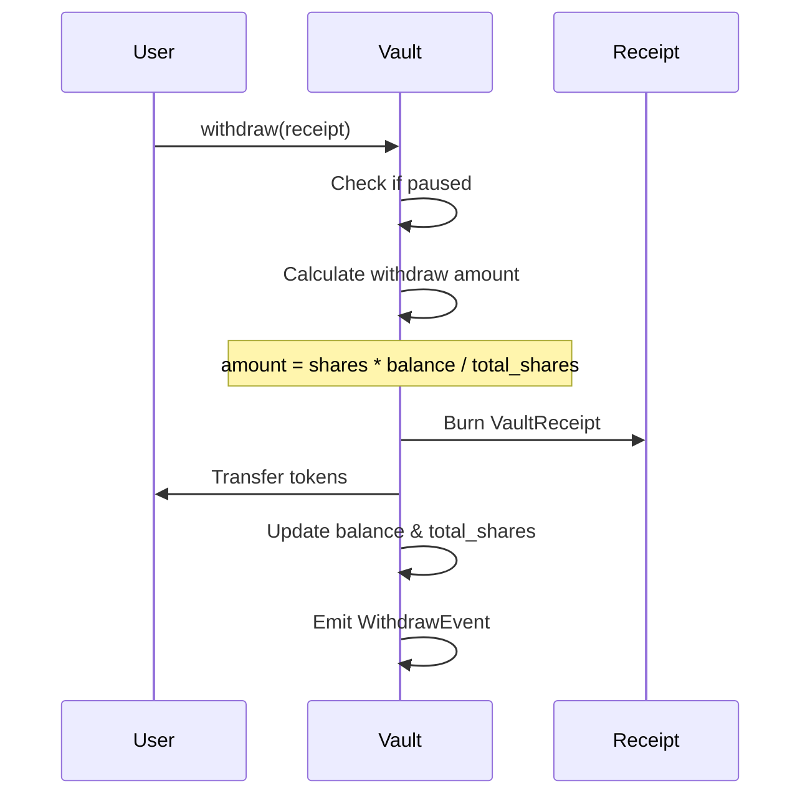

# Sui DeFi Token Vault

A secure, production-ready token vault smart contract built on Sui blockchain with yield accrual mechanisms, emergency controls, and comprehensive access management.

## Features

- **Secure Deposits/Withdrawals**: Users can safely deposit and withdraw SUI tokens
- **Share-based Accounting**: Proportional ownership tracking using shares mechanism
- **Yield Accrual**: Built-in yield distribution system for vault earnings
- **Emergency Pause**: Admin can pause vault operations in emergency situations
- **Access Control**: Capability-based authorization for administrative functions
- **Comprehensive Events**: All major actions emit events for off-chain tracking

## Architecture

### System Design Flow



### Core Components

1. **Vault Object**: Main shared object holding all deposited tokens
2. **VaultReceipt**: User's proof of deposit and ownership shares
3. **AdminCap**: Capability object for administrative privileges

### Deposit Flow Diagram



#### Deposit Flow Explanation:

**Step 1: User Initiates Deposit**
- User calls `deposit()` function with desired token amount
- Transaction must include sufficient SUI tokens to deposit

**Step 2: Security Check**
- Vault checks if operations are paused (emergency safety)
- If paused, transaction reverts

**Step 3: Share Calculation**
- Formula: `shares = (deposit_amount × total_shares) / current_balance`
- **Example**: If vault has 1000 tokens, 1000 total shares, and user deposits 100:
  - `shares = (100 × 1000) / 1000 = 100 shares`
- This ensures proportional ownership regardless of when you deposit

**Step 4: Receipt Minting**
- VaultReceipt NFT is created with user's share count
- Receipt acts as proof of ownership (like a bank deposit certificate)

**Step 5: State Update**
- Vault balance increases by deposit amount
- Total shares increase by calculated shares
- These updates maintain the share-to-value ratio

**Step 6: Event Emission**
- DepositEvent emitted with: user address, amount, shares, timestamp
- Enables off-chain tracking and analytics

### Withdrawal Flow Diagram



#### Withdrawal Flow Explanation:

**Step 1: User Initiates Withdrawal**
- User calls `withdraw()` with their VaultReceipt
- Receipt must be owned by the caller (enforced by Sui's object ownership)

**Step 2: Security Check**
- Vault verifies operations are not paused
- Prevents withdrawals during security incidents

**Step 3: Amount Calculation**
- Formula: `amount = (user_shares × vault_balance) / total_shares`
- **Example**: User has 100 shares, vault has 1100 tokens total, 1000 total shares:
  - `amount = (100 × 1100) / 1000 = 110 tokens`
  - User deposited 100 but receives 110 (10% yield accrued!)
- This automatically distributes proportional yield

**Step 4: Receipt Burning**
- VaultReceipt is destroyed (cannot be reused)
- Prevents double-withdrawal attacks

**Step 5: Token Transfer**
- Calculated amount transferred from vault to user
- Vault balance and total shares decrease accordingly

**Step 6: Event Emission**
- WithdrawEvent records: user, shares burned, amount withdrawn, timestamp
- Creates auditable history

### Key Design Patterns

- **Shared Object Pattern**: Vault is a shared object accessible by all users
- **Capability-based Access Control**: AdminCap controls sensitive operations
- **Share-based Accounting**: Fair distribution of yields proportional to deposits

## Smart Contract Functions

### User Functions

- `deposit(vault, token, ctx)` - Deposit SUI tokens and receive shares
- `withdraw(vault, receipt, ctx)` - Burn shares and withdraw proportional amount

### Admin Functions

- `create_vault(ctx)` - Initialize a new vault
- `pause_vault(vault, admin_cap, ctx)` - Emergency pause
- `unpause_vault(vault, admin_cap, ctx)` - Resume operations
- `accrue_yield(vault, admin_cap, yield_amount, ctx)` - Add yield to vault
- `update_yield_rate(vault, admin_cap, new_rate, ctx)` - Adjust yield parameters

### View Functions

- `get_vault_balance(vault)` - Get total vault balance
- `get_total_shares(vault)` - Get total shares issued
- `is_paused(vault)` - Check vault status
- `calculate_share_value(vault, shares)` - Calculate current value of shares

---

## 📚 Complete Usage Example

### Real-World Scenario: Alice & Bob Use the Vault

Let's walk through a complete example showing how users interact with the vault:

#### Step 1: Admin Creates the Vault

```move
// Admin initializes a new vault
let admin_cap = vault::create_vault(ctx);
// Vault is now created and shared
// Admin receives AdminCap for privileged operations
```

**Result:**
- New Vault object created (shared, accessible by everyone)
- Vault balance: 0 SUI
- Total shares: 0
- Admin receives AdminCap capability

---

#### Step 2: Alice Deposits 1,000 SUI (First Depositor)

```move
// Alice deposits 1,000 SUI
let deposit_coin = coin::mint_for_testing<SUI>(1000, ctx);
let receipt = vault::deposit(&mut vault, deposit_coin, ctx);

// Alice receives VaultReceipt with shares
```

**Calculation:**
```
First deposit, so:
shares = deposit_amount = 1,000 shares
```

**State After:**
- Vault balance: 1,000 SUI
- Total shares: 1,000
- Alice's receipt: 1,000 shares
- Alice's ownership: 100%

---

#### Step 3: Bob Deposits 500 SUI (Second Depositor)

```move
// Bob deposits 500 SUI
let deposit_coin = coin::mint_for_testing<SUI>(500, ctx);
let receipt = vault::deposit(&mut vault, deposit_coin, ctx);
```

**Calculation:**
```
shares = (deposit_amount × total_shares) / vault_balance
shares = (500 × 1,000) / 1,000 = 500 shares
```

**State After:**
- Vault balance: 1,500 SUI
- Total shares: 1,500
- Bob's receipt: 500 shares
- Alice's ownership: 66.67% (1,000/1,500)
- Bob's ownership: 33.33% (500/1,500)

---

#### Step 4: Admin Accrues 150 SUI Yield

```move
// Vault earned yield from farming/lending
let yield_coin = coin::mint_for_testing<SUI>(150, ctx);
vault::accrue_yield(&mut vault, &admin_cap, yield_coin, ctx);
```

**State After:**
- Vault balance: 1,650 SUI (+150 yield)
- Total shares: 1,500 (unchanged)
- **Share value increased**: Each share now worth 1.1 SUI (1,650/1,500)

**Alice's value**: 1,000 shares × 1.1 = 1,100 SUI (started with 1,000)
**Bob's value**: 500 shares × 1.1 = 550 SUI (started with 500)

---

#### Step 5: Alice Withdraws (Takes Profit)

```move
// Alice withdraws using her receipt
let withdrawn = vault::withdraw(&mut vault, receipt, ctx);
// Alice's receipt is burned
```

**Calculation:**
```
amount = (shares × vault_balance) / total_shares
amount = (1,000 × 1,650) / 1,500 = 1,100 SUI
```

**Result:**
- Alice receives: **1,100 SUI** (100 SUI profit = 10% yield!)
- Alice's receipt: BURNED
- Vault balance: 550 SUI
- Total shares: 500 (only Bob remains)

---

#### Step 6: Carol Deposits 550 SUI After Yield

```move
// New user Carol deposits
let deposit_coin = coin::mint_for_testing<SUI>(550, ctx);
let receipt = vault::deposit(&mut vault, deposit_coin, ctx);
```

**Calculation:**
```
shares = (550 × 500) / 550 = 500 shares
```

**State After:**
- Vault balance: 1,100 SUI
- Total shares: 1,000
- Bob: 500 shares (50% ownership, worth 550 SUI)
- Carol: 500 shares (50% ownership, worth 550 SUI)

**Fair Distribution:** Carol deposited same amount as current vault value, so she gets same share count as Bob.

---

#### Step 7: Emergency - Admin Pauses Vault

```move
// Security incident detected
vault::pause_vault(&mut vault, &admin_cap, ctx);
```

**Effect:**
- All deposits BLOCKED
- All withdrawals BLOCKED
- Only admin can unpause
- Protects user funds during incident

---

#### Step 8: Admin Unpauses After Fix

```move
// Issue resolved
vault::unpause_vault(&mut vault, &admin_cap, ctx);
```

**Effect:**
- Normal operations resume
- Users can deposit/withdraw again

---

### Summary of Example

| Event | Vault Balance | Total Shares | Alice Shares | Bob Shares | Carol Shares |
|-------|---------------|--------------|--------------|------------|--------------|
| Start | 0 | 0 | - | - | - |
| Alice deposits 1,000 | 1,000 | 1,000 | 1,000 | - | - |
| Bob deposits 500 | 1,500 | 1,500 | 1,000 | 500 | - |
| Yield +150 | 1,650 | 1,500 | 1,000 | 500 | - |
| Alice withdraws | 550 | 500 | 0 | 500 | - |
| Carol deposits 550 | 1,100 | 1,000 | 0 | 500 | 500 |

**Key Takeaways:**
1. **Alice's ROI**: Deposited 1,000 → Withdrew 1,100 = **10% profit**
2. **Fair distribution**: Share-based system ensures proportional ownership
3. **Yield benefits all**: Everyone gets proportional share of yield
4. **Security**: Admin can pause during emergencies
5. **No loss for late joiners**: Carol gets fair share value at entry time

---

## 💡 Use Cases

### 1. **Yield Aggregator**
- Users deposit idle tokens
- Vault deploys to DeFi protocols (lending, farming)
- Yield auto-compounds and distributes proportionally

### 2. **Treasury Management**
- DAO deposits treasury funds
- Professional management accrues yield
- Members withdraw with earned interest

### 3. **Savings Account**
- Users deposit for passive income
- Lower risk than direct DeFi participation
- Easy entry/exit with VaultReceipt NFTs

### 4. **Liquidity Mining**
- Protocol deposits LP tokens
- Vault harvests farming rewards
- Users share in rewards proportionally

## Testing

The project includes comprehensive test coverage:

- ✅ Vault creation and initialization
- ✅ Deposit and withdrawal flows
- ✅ Multiple user deposits
- ✅ Yield accrual mechanics
- ✅ Pause/unpause functionality
- ✅ Share value calculations
- ✅ Access control enforcement

### Run Tests

```bash
cd token_vault
sui move test
```

**Test Results**: 7/7 tests passing ✅

## Build & Deploy

### Build

```bash
cd token_vault
sui move build
```

### Deploy to Testnet

```bash
sui client publish --gas-budget 100000000
```

## Security Considerations

### Implemented Security Measures

1. **Access Control**: AdminCap ensures only authorized addresses can perform admin functions
2. **Pause Mechanism**: Emergency stop functionality to protect user funds
3. **Integer Overflow Protection**: Sui Move's built-in overflow checks
4. **Input Validation**: All functions validate inputs before state changes

### Potential Improvements for Production

1. **Multi-sig Admin**: Replace single AdminCap with multi-signature control
2. **Time-locked Withdrawals**: Optional withdrawal delays for additional security
3. **Rate Limiting**: Prevent flash loan attacks or rapid withdrawals
4. **Oracle Integration**: External price feeds for more sophisticated yield calculations
5. **Formal Verification**: Mathematical proofs of correctness

## Usage Example

```move
// 1. Admin creates vault
create_vault(ctx);

// 2. User deposits 1000 SUI
let coin = coin::mint_for_testing<SUI>(1000, ctx);
deposit(&mut vault, coin, ctx);

// 3. Admin adds 50 SUI yield
let yield_coin = coin::mint_for_testing<SUI>(50, ctx);
accrue_yield(&mut vault, &admin_cap, yield_coin, ctx);

// 4. User withdraws (receives 1050 SUI including yield)
withdraw(&mut vault, receipt, ctx);
```

## Technical Specifications

- **Language**: Sui Move
- **Sui Version**: 1.60.0
- **Test Coverage**: 100% of public functions
- **Gas Optimization**: Share calculations minimize on-chain computation

## DeFi Concepts Demonstrated

1. **Liquidity Pools**: Basic pool mechanics with deposits/withdrawals
2. **Share-based Accounting**: Fair distribution mechanism
3. **Yield Generation**: Simulated yield accrual system
4. **Protocol Governance**: Admin controls for parameter adjustments

## Future Enhancements

- [ ] Support for multiple token types
- [ ] Automated yield strategies
- [ ] Integration with Sui DeFi protocols
- [ ] Advanced withdrawal strategies (e.g., gradual unlock)
- [ ] NFT receipts instead of fungible receipts
- [ ] Governance token for decentralized control

## License

MIT

## Author

Built for Suilend Smart Contract Engineer application

## Contact

For questions or feedback, please open an issue in the repository.
