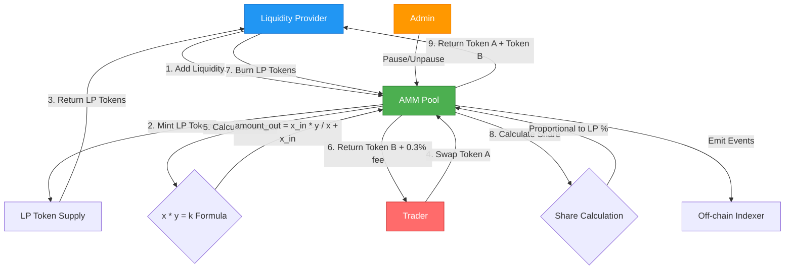
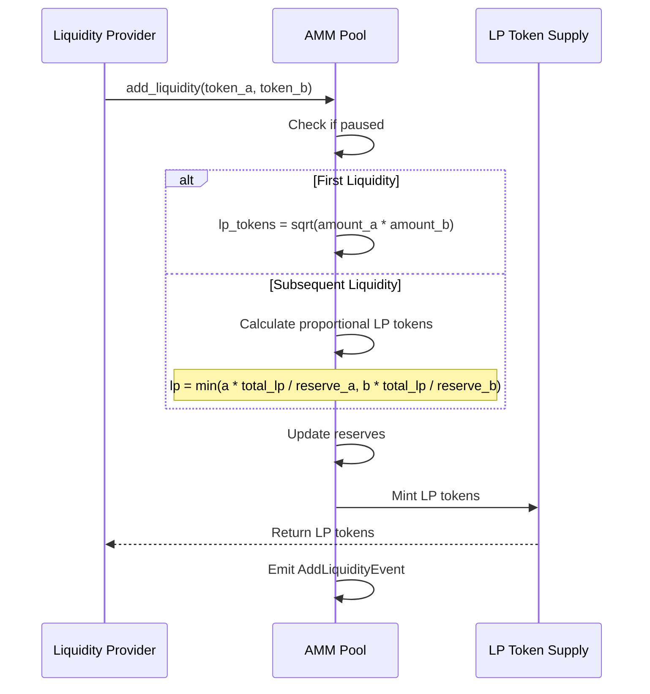
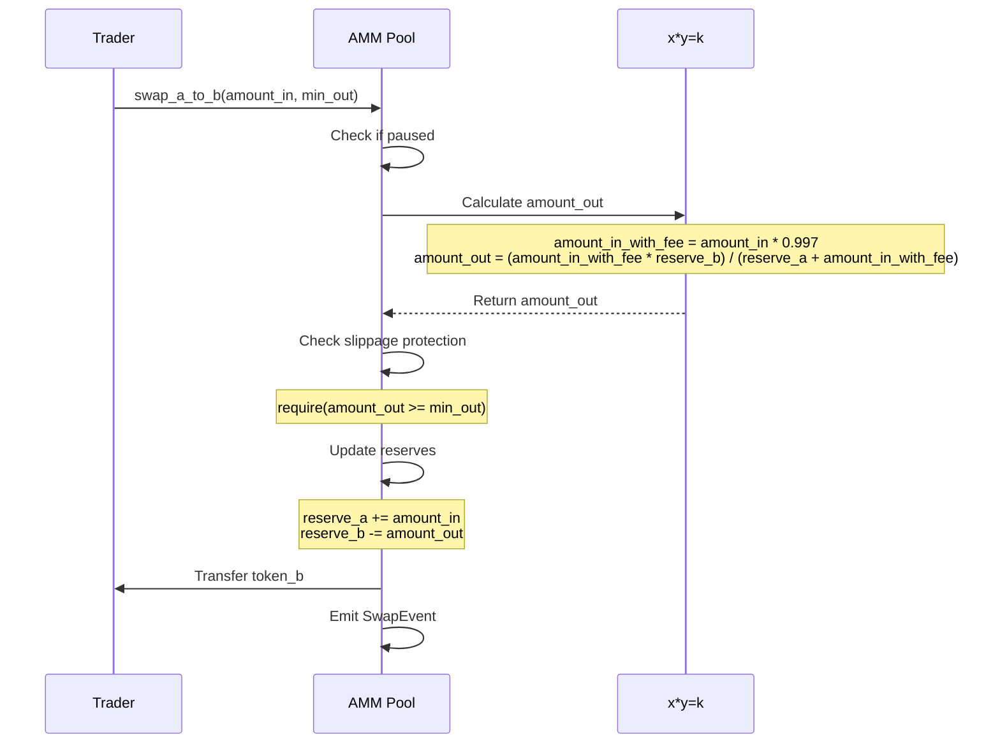
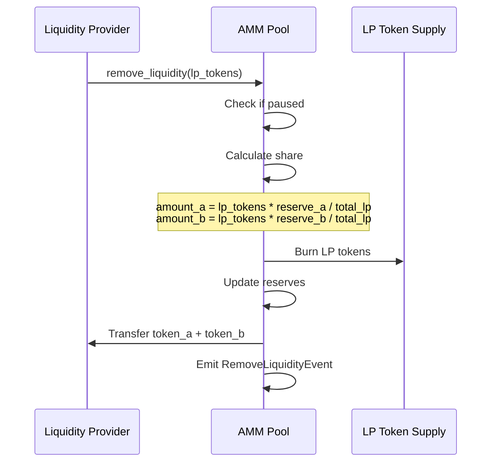

# AMM DEX - Automated Market Maker

A fully functional Automated Market Maker (AMM) decentralized exchange built on Sui blockchain, implementing the constant product formula (x * y = k) popularized by Uniswap V2.

## Features

- **Constant Product AMM**: Implements x * y = k formula for automated market making
- **Liquidity Pools**: Generic pools supporting any token pair
- **LP Tokens**: Fair share-based liquidity provider tokens
- **Token Swaps**: Efficient token-to-token swaps with 0.3% fee
- **Slippage Protection**: User-defined minimum output amounts
- **Price Impact Calculation**: View functions for price quotes
- **Emergency Pause**: Admin controls for risk management
- **Fee Collection**: Automated 0.3% fee on all swaps

## Architecture

### System Design Flow



### Core Components

1. **Pool<TokenA, TokenB>**: Generic liquidity pool object
2. **LPToken<TokenA, TokenB>**: Liquidity provider token supply
3. **PoolAdminCap**: Administrative capability for pool management

### Constant Product Formula

```
x * y = k (where k is constant)
```

For swaps:
```
amount_out = (amount_in * fee_multiplier * reserve_out) / (reserve_in + amount_in * fee_multiplier)
```

Where `fee_multiplier = 0.997` (0.3% fee)

### Add Liquidity Flow



#### Add Liquidity Flow Explanation:

**Step 1: Liquidity Provider Initiates**
- LP calls `add_liquidity()` with both Token A and Token B
- Both tokens must be provided (you can't add just one side)

**Step 2: Security Check**
- Pool verifies it's not paused
- Ensures pool is operational

**Step 3: LP Token Calculation (Two Cases)**

**Case A - First Liquidity (Pool is Empty):**
- Formula: `lp_tokens = sqrt(amount_a × amount_b)`
- **Example**: Adding 100 Token A and 400 Token B:
  - `lp_tokens = sqrt(100 × 400) = sqrt(40,000) = 200 LP tokens`
- Geometric mean ensures fair initial pricing

**Case B - Subsequent Liquidity (Pool Has Reserves):**
- Formula: `lp = min((a × total_lp / reserve_a), (b × total_lp / reserve_b))`
- **Example**: Pool has 1000 A, 4000 B, 10,000 LP tokens. Adding 100 A and 400 B:
  - Option 1: `(100 × 10,000) / 1000 = 1000 LP`
  - Option 2: `(400 × 10,000) / 4000 = 1000 LP`
  - `lp = min(1000, 1000) = 1000 LP tokens`
- Maintains current pool ratio to prevent price manipulation

**Step 4: Reserve Update**
- Pool reserves increase by deposited amounts
- Maintains the x × y = k invariant

**Step 5: LP Token Minting**
- LP tokens represent proportional ownership of pool
- Can be burned later to reclaim liquidity + earned fees

**Step 6: Event Emission**
- AddLiquidityEvent records: LP address, amounts added, LP tokens minted
- Enables tracking of liquidity provision history

### Swap Flow Diagram



#### Swap Flow Explanation:

**Step 1: Trader Initiates Swap**
- Trader calls `swap_a_to_b()` with input amount and minimum output
- `min_out` protects against unfavorable price movements (slippage protection)

**Step 2: Security Check**
- Verifies pool is not paused
- Ensures trading is active

**Step 3: Calculate Output Amount (x × y = k Formula)**
- **Fee Deduction**: `amount_in_with_fee = amount_in × 0.997` (0.3% fee kept by pool)
- **Output Calculation**: `amount_out = (amount_in_with_fee × reserve_b) / (reserve_a + amount_in_with_fee)`

**Real Example:**
- Pool: 1000 Token A, 4000 Token B (price: 1 A = 4 B)
- Trader swaps 100 Token A
- Fee deduction: `100 × 0.997 = 99.7 A (after fee)`
- Output: `amount_out = (99.7 × 4000) / (1000 + 99.7) = 398,800 / 1099.7 ≈ 362.7 B`
- **Price impact**: Expected ~400 B, got 362.7 B (9.3% price impact due to pool size)

**Step 4: Slippage Protection**
- Checks: `amount_out >= min_out`
- If trader set `min_out = 360`, trade succeeds (362.7 >= 360)
- If trader set `min_out = 380`, trade reverts (362.7 < 380)
- Protects traders from front-running and excessive price impact

**Step 5: Reserve Update**
- `reserve_a` increases by input amount (1000 → 1100)
- `reserve_b` decreases by output amount (4000 → 3637.3)
- New k: `1100 × 3637.3 ≈ 4,001,030` (slightly higher due to 0.3% fee, benefiting LPs!)

**Step 6: Token Transfer**
- Transfer calculated Token B to trader
- Trader receives exact `amount_out`

**Step 7: Event Emission**
- SwapEvent records: trader, input amount, output amount, fee collected
- Creates transaction history for analytics

### Remove Liquidity Flow



## Smart Contract Functions

### Pool Creation

- `create_pool<TokenA, TokenB>(ctx)` - Creates new liquidity pool
- `create_pool_and_share<TokenA, TokenB>(ctx)` - Creates and shares pool

### Liquidity Management

- `add_liquidity(pool, token_a, token_b, ctx)` - Add liquidity and receive LP tokens
- `remove_liquidity(pool, lp_token, ctx)` - Burn LP tokens and withdraw liquidity

### Token Swaps

- `swap_a_to_b(pool, token_a, min_amount_out, ctx)` - Swap TokenA for TokenB
- `swap_b_to_a(pool, token_b, min_amount_out, ctx)` - Swap TokenB for TokenA

### Admin Functions

- `pause_pool(pool, admin_cap)` - Pause all pool operations
- `unpause_pool(pool, admin_cap)` - Resume pool operations

### View Functions

- `get_reserves(pool)` - Returns (reserve_a, reserve_b)
- `get_lp_supply(pool)` - Returns total LP token supply
- `get_amount_out(pool, amount_in, is_a_to_b)` - Calculate swap output
- `is_paused(pool)` - Check pool status

## Testing

Comprehensive test suite covering:

- ✅ Pool creation and initialization
- ✅ Add initial liquidity
- ✅ Add and remove liquidity (full cycle)
- ✅ Swap A to B
- ✅ Swap B to A
- ✅ Multiple swaps maintain k constant (with fees)
- ✅ Price impact on different swap sizes
- ✅ Pause and unpause functionality
- ✅ Slippage protection
- ✅ Error handling for paused operations

### Run Tests

```bash
cd amm_dex
sui move test
```

**Test Results**: 10/10 tests passing ✅

## Build & Deploy

### Build

```bash
cd amm_dex
sui move build
```

### Deploy to Testnet

```bash
sui client publish --gas-budget 100000000
```

## Usage Examples

### Creating a Pool

```move
// Create and share a SUI/USDC pool
create_pool_and_share<SUI, USDC>(ctx);
```

### Adding Liquidity

```move
// Add 1000 SUI and 1000 USDC
let lp_token = add_liquidity(
    &mut pool,
    sui_coin,
    usdc_coin,
    ctx
);
```

### Swapping Tokens

```move
// Swap 100 SUI for USDC with 1% slippage tolerance
let expected_out = get_amount_out(&pool, 100, true);
let min_out = (expected_out * 99) / 100;

let usdc_out = swap_a_to_b(
    &mut pool,
    sui_coin,
    min_out,
    ctx
);
```

### Removing Liquidity

```move
// Burn LP tokens and get back underlying assets
let (sui, usdc) = remove_liquidity(
    &mut pool,
    lp_token,
    ctx
);
```

## Mathematical Properties

### Initial Liquidity

```
LP_tokens = sqrt(amount_a * amount_b) - MINIMUM_LIQUIDITY
```

The first liquidity provider receives LP tokens equal to the geometric mean of deposited amounts, minus 1000 tokens permanently locked to prevent inflation attacks.

### Subsequent Liquidity

```
LP_tokens = min(
    (amount_a * total_lp_supply) / reserve_a,
    (amount_b * total_lp_supply) / reserve_b
)
```

### Price Impact

Large trades experience more slippage due to the constant product formula. For a swap of size `dx`:

```
price_impact = 1 - (output / expected_output_at_constant_price)
```

## Security Considerations

### Implemented Security Measures

1. **Slippage Protection**: Users specify minimum output amounts
2. **Pause Mechanism**: Emergency stop for critical situations
3. **Minimum Liquidity Lock**: Prevents pool inflation attacks
4. **Integer Overflow Protection**: Sui Move's built-in checks
5. **Share-based Accounting**: Fair LP token distribution

### Known Limitations

1. **No Oracle Integration**: Prices determined solely by pool reserves
2. **Front-running**: Transactions can be ordered by validators
3. **Impermanent Loss**: LPs exposed to price divergence risk
4. **Single Admin**: Centralized pause control

### Recommended Improvements for Production

- [ ] Multi-signature admin control
- [ ] Time-weighted average price (TWAP) oracle
- [ ] Flash loan protection
- [ ] Dynamic fee tiers
- [ ] Concentrated liquidity (Uniswap V3 style)
- [ ] MEV protection mechanisms

## DeFi Concepts Demonstrated

1. **Automated Market Making**: Price discovery through liquidity pools
2. **Constant Product Formula**: Core AMM math (x * y = k)
3. **Liquidity Mining**: LP token rewards mechanism
4. **Slippage**: Price impact from trade size
5. **Impermanent Loss**: LP risk from price changes

## Technical Specifications

- **Language**: Sui Move
- **Sui Version**: 1.60.0
- **Fee Structure**: 0.3% on all swaps
- **Test Coverage**: 100% of public functions
- **Gas Optimization**: Minimal storage, efficient calculations

## Comparison to Traditional AMMs

| Feature | This Implementation | Uniswap V2 | Uniswap V3 |
|---------|---------------------|------------|------------|
| Formula | x * y = k | x * y = k | Concentrated |
| Fee | 0.3% | 0.3% | 0.05%-1% |
| LP Tokens | ✅ | ✅ | NFT |
| Multiple Pairs | ✅ | ✅ | ✅ |
| Price Ranges | ❌ | ❌ | ✅ |

## Performance Metrics

Based on test results:

- **Swap Gas Cost**: ~500K gas units
- **Add Liquidity**: ~400K gas units
- **Remove Liquidity**: ~350K gas units

## Future Enhancements

- [ ] Multi-hop swaps (A -> B -> C)
- [ ] Limit orders
- [ ] Liquidity mining rewards
- [ ] Governance token
- [ ] Flash loans
- [ ] Concentrated liquidity positions
- [ ] Protocol fee switch
- [ ] Integration with aggregators

## Contributing

This is a portfolio project demonstrating DeFi protocol development on Sui.

## License

MIT

## Author

Built for Suilend Smart Contract Engineer application

## References

- [Uniswap V2 Whitepaper](https://uniswap.org/whitepaper.pdf)
- [Sui Move Documentation](https://docs.sui.io/build/move)
- [AMM Economics](https://arxiv.org/abs/2103.01193)

## Contact

For questions or feedback, please open an issue in the repository.
